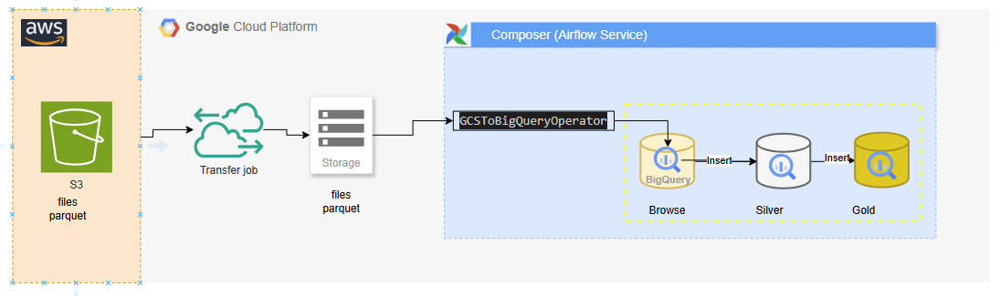

## Ingestion from parquet S3 to medallion architecture on bigquery using Composer

This architecture illustrates a workflow for transferring parquet files and processing data using cloud services and data management tools. 
Below is a detailed description of each component and its role in the system:

## Components

1. **Amazon S3 (Simple Storage Service)**
   - **Role**: Storage of files in an S3 bucket.
   - **Description**: The S3 bucket serves as the initial storage for files that need to be transferred and processed. It acts as the starting point for the data flow.

2. **Transfer Job (Google Cloud Platform)**
   - **Role**: Transfer files parquet from the S3 bucket to Google Cloud Storage.
   - **Description**: A transfer job is set up to move files from the S3 bucket to storage in the Google Cloud Platform. This enables integration between different cloud services.

3. **Google Cloud Storage**
   - **Role**: Intermediate storage of files.
   - **Description**: After transfer, files are temporarily stored in Google Cloud Storage before being processed.

4. **Composer (Airflow Service)**
   - **Role**: Orchestration of data workflows.
   - **Description**: Google Cloud Composer, based on Apache Airflow, is used to orchestrate and manage complex workflows. It allows for the automation of data processing tasks.

5. **`GCSToBigQueryOperator`**
   - **Role**: Operator from Composer to transfer data from Google Cloud Storage to BigQuery.
   - **Description**: This operator is responsible for moving data stored in Google Cloud Storage to BigQuery for analysis.

6. **BigQuery**
   - **Role**: Data storage and analysis.
   - **Description**: BigQuery is a managed data warehouse that enables fast queries and analysis of large datasets. Data is inserted into BigQuery for processing and analysis.

7. **Silver and Gold Tables**
   - **Role**: Data processing layers with merge
   - **Description**: After insertion into BigQuery, data goes through different processing layers. The "Silver" table may represent cleaned and transformed data, while the "Gold" table may represent aggregated data ready for final analysis.

